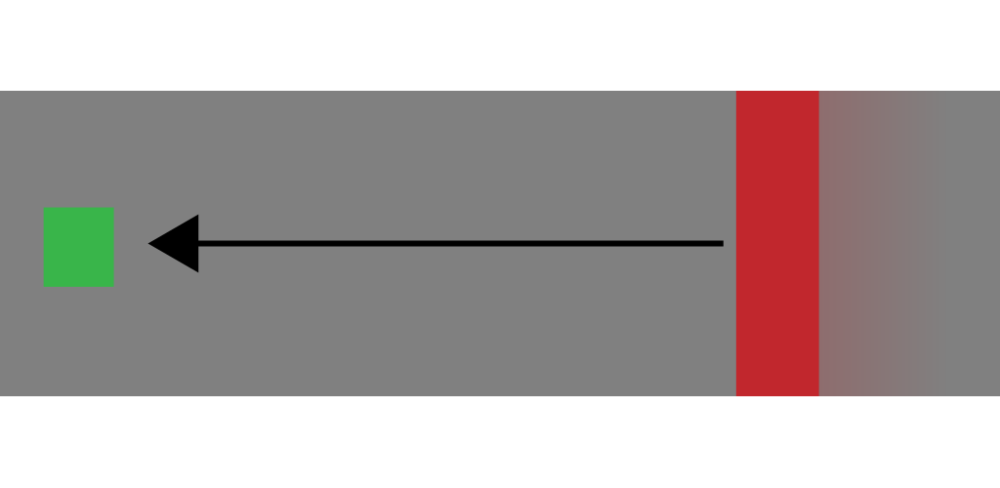

# Machine learning Jumper
## Groep 1
|Naam|Nr|
|-|-|
|Wouter Van Nueten|107229|
|Maxim Janssens|107104|

## Introductie
Het doel van deze repo is illustreren hoe een simpele ml-agent binnenin unity werkt.

We doen dit aan de hand van een simpel spel. Het spel verloopt als volgt: er is een agent (die we moeten trainen) en een obstakel (die slechts 1 ding kan: recht vooruit gaan en botsen tegen alles wat op zijn weg komt).

In de volgende illustratie zien we de agent in het groen aangeduid, en het obstakel in het rood. Het spel speelt zich af in een 3D-wereld waarin de agent de mogelijkheid heeft om te springen. De agent zal moeten leren om over het obstakel te springen wanneer het op hem afkomt.

Om ervoor te zorgen dat de agent weet wat hij moet doen, zorgen we dat hij een reward krijgt voor op de grond te staan, en tegelijk ook wordt gestraft als het obstakel hem kan raken.

Als extraatje zal het voor de agent ook mogelijk zijn om bonuspunten te krijgen door `munten` te vangen die op willekeurige plaatsen in het speelveld verschijnen. Om deze munten te vangen kan de agent zich ook bewegen naar links en naar rechts.

## Set-up
Alvorens je kan beginnen met zelf de agent te trainen, zal je eerst een aantal dingen nodig hebben:
 - Unity (uiteraard)
 - Python
 - ML agents (`pip3 install mlagents`)
 - Tensorboard (niet noodzakelijk, wel handig: `pip3 install tensorboard`)

## De training

Zodra je klaar bent met de installatie van bovenstaande programma's, kan je beginnen met het trainen van de agent.

Dit doe je door het project in Unity te openen en tegelijk ook een terminal-venster te openen in de `Learning`-map.

In het terminal-venster type je het volgende: `mlagents-learn jumper.yml --run-id Jumper-01`

Vervolgens ga je terug naar Unity, en druk je op de afspeelknop. De agent zal meteen met de training beginnen en je zal merken dat hij na verloop van tijd steeds beter en beter wordt in het spelen van het spel.

Als je even wilt kijken hoe snel de agent effectief is aan het bijleren, kan je in het mapje `Learning` een nieuw terminal-venster openen, waarin je `tensorboard --logdir results` typt.

Vervolgens zal je via [http://localhost:6006](http://localhost:6006) een aantal grafieken kunnen raadplegen die aangeven hoe goed het neuraal netwerk is aan het leren.